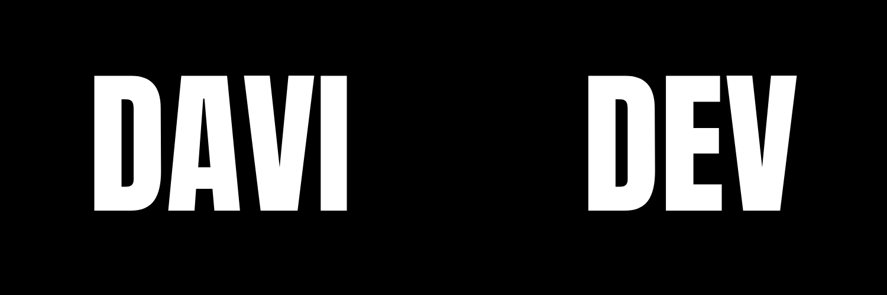

  

## 👋 Sobre

Sou **Desenvolvedor Backend**, com foco em **Node.js (TypeScript)** e **Go**.  
Tenho interesse em **arquitetura de software**, **sistemas escaláveis**, **boas práticas de engenharia** e **ambientes Linux**.

Atualmente desenvolvo sistemas e APIs voltados a aplicações reais, buscando código limpo, previsível e sustentável.

---

## 🧩 Atuação atual

- Backend developer na **Revista do Empreendedor Jovem**
- Desenvolvimento de **APIs REST**
- Estruturação de projetos com foco em **manutenibilidade**
- Integração com bancos de dados relacionais

---

## 🧠 Conhecimentos técnicos

### Linguagens
- TypeScript
- JavaScript
- Go

### Backend
- Node.js
- Express
- APIs REST
- Arquitetura em camadas
- Princípios de Clean Code

### Bancos de dados
- PostgreSQL
- MySQL

### Infra & Ferramentas
- Linux
- Git
- Docker (nível inicial)
- Ambientes UNIX-like

---

## 📐 Interesses técnicos

- Arquitetura de software
- Escalabilidade
- Design de APIs
- Sistemas distribuídos (em estudo)
- Boas práticas de backend

---

## 📌 Projetos

- GitHub: https://github.com/davi-amaraldev  
- Site pessoal: https://imdavi.com.br  
- Artigos técnicos: https://revistadoempreendedorjovem.com.br  

---

## 📫 Contato

- Email: **davicodarini@gmail.com**
- LinkedIn: https://www.linkedin.com/in/davi-amaral-a11955372/

---

> _“Prefiro sistemas bem pensados a soluções rápidas.”_
